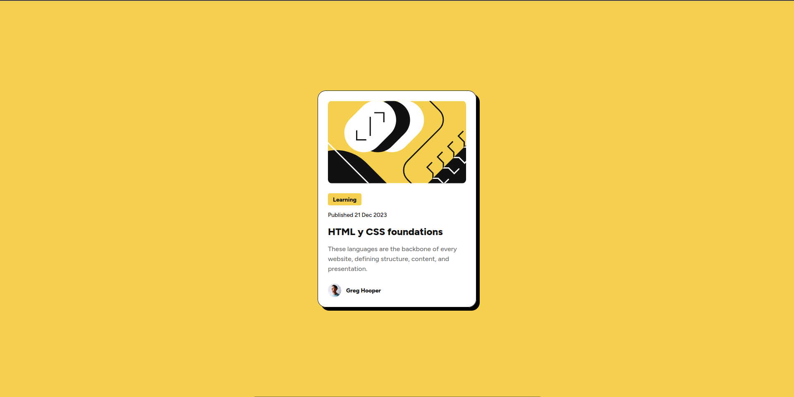

# Frontend Mentor - Blog Preview Card

This is a solution to the [Blog Preview Card challenge on Frontend Mentor](https://www.frontendmentor.io/solutions/blog-preview-card-q4mAltPkuF). Frontend Mentor challenges help you improve your coding skills by building realistic projects. 

## Table of contents

- [Overview](#overview)
  - [Screenshot](#screenshot)
  - [Links](#links)
- [My process](#my-process)
  - [Built with](#built-with)
  - [What I learned](#what-i-learned)
  - [Continued development](#continued-development)
  - [Useful resources](#useful-resources)
- [Author](#author)

## Overview

### Screenshot



### Links

- Solution URL: [https://github.com/juanhastier/blog-preview-card](https://github.com/juanhastier/blog-preview-card)
- Live Site URL: [https://juanhastier.github.io/blog-preview-card/](https://juanhastier.github.io/blog-preview-card/)

## My process

### Built with

- Semantic HTML5 markup
- CSS custom properties
- Flexbox
- Mobile-first workflow
- [Astro](https://astro.build/) - JS web framework

### What I learned

I learned how to use the CSS clamp() function to resize fonts without using media queries.

Example of code used in my challenge below:

```css
h1 {
  font-size: clamp(20px, 4.6vw, 24px);
  font-weight: 800;
}
```

### Continued development

I would like to continue learning to write semantic and accessible HTML.
Continue to delve deeper into the concepts of Astro, this wonderful javascript web framework

### Useful resources

- [MDN](https://developer.mozilla.org/en-US/) - Here I learned how to use the clamp() function. I really enjoyed studying on MDN, and I will continue to use it in the future.
- [Astro](https://astro.build/) - This is an amazing site where you can learn how to use this technology.

## Author

- Frontend Mentor - [@juanhastier](https://www.frontendmentor.io/profile/juanhastier)